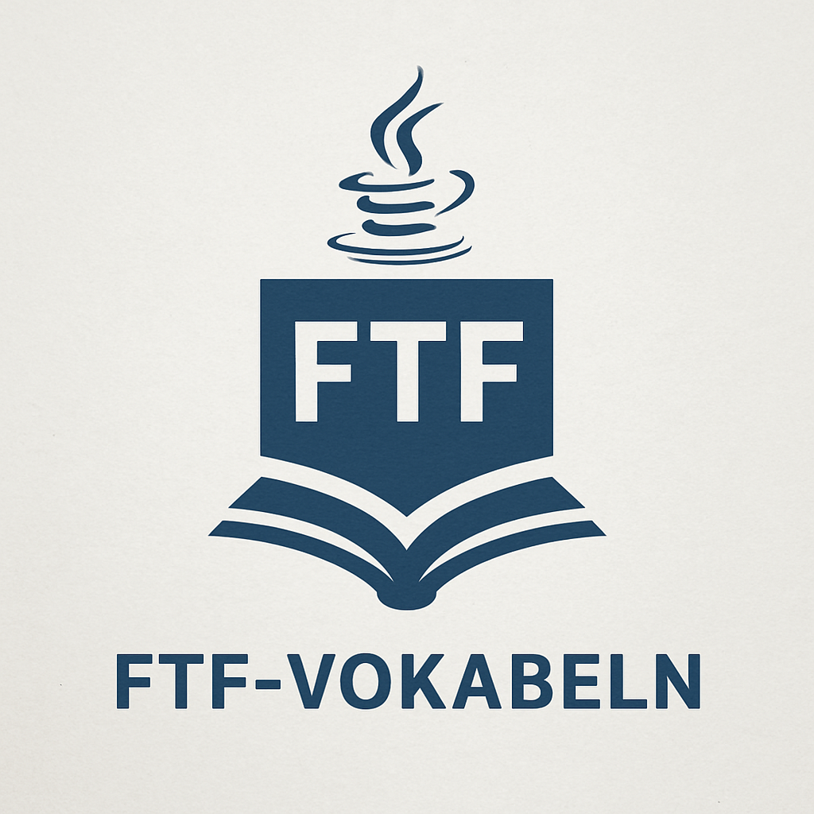

[](https://github.com/Chaosfelix4451/FTF-Vokabeln/actions/workflows/ant.yml)

FTF-Vokabeln ist ein kleiner Vokabeltrainer auf Basis von JavaFX. Das Projekt entstand im Rahmen eines Schulprojekts und hilft beim Üben englischer Wörter.

## Funktionen

- zufällige Abfragen in beide Richtungen
- Nutzerverwaltung mit gespeichertem Highscore
- Anzeige des Scoreboards
- Speichern der Einstellungen
- einfache Soundeffekte
- zentraler `UserSystem`-Verwaltungscode wird jetzt statisch genutzt

## Build

Vorausgesetzt werden JDK 11, JavaFX und Ant. Unter Ubuntu können die Pakete wie folgt installiert und das JAR gebaut werden:

```bash
sudo apt-get update && sudo apt-get install -y ant openjdk-11-jdk openjfx
ant jar
java -jar build/jar/FTF-Vokabeln.jar
```

## Dokumentation

Ausführliche Erläuterungen zu Aufbau und Funktionsweise bietet die interaktive Dokumentation unter [`docs/index.html`](docs/index.html). Eine kurze Übersicht der wichtigsten Methoden steht in `docs/Methodenliste.md`.

## Mitwirken

Fehlerberichte und Pull Requests sind willkommen.

## Autoren

- Felix
- Toby
- Feras

## Lizenz

Dieses Projekt dient zu Lernzwecken und besitzt keine explizite Lizenzdatei.
